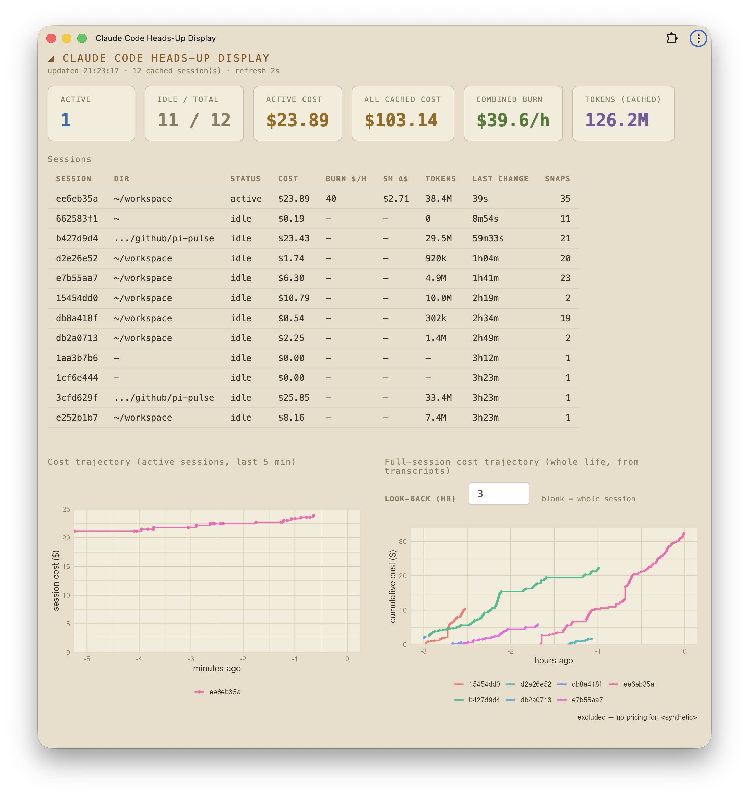

# cchud — Claude Code Heads-Up Display

A standalone-window launcher for `app.R`, the live cost/burn-rate HUD for
Claude Code sessions. It opens the Shiny app in a chromeless Chromium **app
window** (no tabs, no address bar, its own dock/taskbar entry) instead of a
browser tab.



## Layout

Self-contained repo — the HUD and its data source live together:

```
cchud/
├── app.R                     # the Shiny HUD
├── run.R                     # the launcher (boots app.R + opens the window)
├── make-icons.R              # regenerates the app icons into www/
├── statusline.sh             # companion writer — feeds the cost cache (see below)
├── cchud.command             # macOS — double-click in Finder
├── cchud.sh                  # Linux / generic POSIX
├── cchud.bat                 # Windows — double-click
├── cchud.desktop             # Linux desktop entry
├── www/
│   ├── manifest.webmanifest  # PWA manifest (enables a custom-icon install)
│   ├── icon-192.png          # \
│   ├── icon-512.png          #  } generated by make-icons.R
│   └── icon.png              # /
├── LICENSE                   # MIT
├── .gitignore
└── README.md
```

## Requirements

- **R** with packages: `shiny`, `ggplot2`, `jsonlite`, `scales`
  (`scales` ships with `ggplot2`; the launcher checks and tells you if any are missing).
- A **Chromium-family browser** (Chrome, Edge, Brave, or Chromium) for the
  standalone window. Without one, it falls back to your default browser as a tab.
- **`callr`** (recommended): lets the launcher run the server in the background
  and shut it down automatically when you close the window.
  `install.packages("callr")`
- **Claude Code**, with its status line pointed at this repo's `statusline.sh`
  (it writes the cost cache the HUD renders). See *Companion* below — without it
  the HUD opens but shows no data.

## Companion: `statusline.sh` (the data source)

The HUD is a viewer; the numbers come from `statusline.sh`, the Claude Code
status-line script bundled here. On every status-line render it appends each
session's cost to `~/.claude/.cost-cache/<session_id>.tsv`, and `app.R` reads
those files. No cache → an empty HUD.

Point Claude Code at it in `~/.claude/settings.json`:

```json
"statusLine": {
  "type": "command",
  "command": "/path/to/cchud/statusline.sh"
}
```

(Adjust the path if you cloned elsewhere.) It takes effect on the next session /
status-line render.

## Run it

- **macOS:** double-click `cchud.command`.
  (Finder may warn the first time — right-click → Open, or:
  `xattr -d com.apple.quarantine cchud.command`.)
- **Windows:** double-click `cchud.bat`.
- **Linux:** `./cchud.sh`, or use `cchud.desktop` (edit paths first).
- **Any OS, from a terminal:** `Rscript run.R`.

## Quitting

- With `callr` installed: **close the window** — the server stops automatically.
- Without `callr`: closing the window leaves the server running; stop it with
  **Ctrl-C** in the terminal (or close the terminal).

## App icon (dock / taskbar)

A Chromium `--app` window's icon is owned by the **browser process**, so the
behavior — and the fix — differs by platform. The app ships a manifest + icons
(in `www/`) that make all three work:

- **Windows:** the `--app` window picks up the icon as its taskbar icon
  automatically — nothing to do.
- **Linux:** the launcher passes `--class=cchud`; install `cchud.desktop` (after
  setting `Icon=` to the absolute path of `www/icon-512.png`). Its
  `StartupWMClass=cchud` binds that icon to the window.
- **macOS:** app-mode windows always show the browser's Dock icon — the only
  supported way to get a custom Dock icon is to **install the app once**:
  with the HUD open, use the browser menu → *Save and Share → Install page as
  app…* (Chrome/Edge) or *…→ Create shortcut → Open as window* (Chromium).
  That creates `~/Applications/<Browser> Apps/Claude Code Heads-Up Display.app` with
  the custom icon. After that, **`run.R` detects and launches that installed
  app automatically** (starting the server first, stopping it on close), so the
  one-click flow is unchanged — just with the right Dock icon.

To customize the icon, edit `make-icons.R` and re-run `Rscript make-icons.R`
(then re-install on macOS so the bundle picks up the new icon).

For a *fully* owned native window (custom icon with zero install step, no
Chromium dependency), the route is an Electron/Tauri shell — heavier, separate
toolchain; out of scope for this launcher.

## Notes

- Port is `4747` (matches `app.R`); change `PORT` in `run.R` if it clashes.
  The installed macOS app records this port at install time — reinstall if you
  change it.
- The window uses a dedicated browser profile under your user cache dir
  (`tools::R_user_dir("cchud", "cache")`), so it stays separate from your main
  browser and remembers its size/position.
